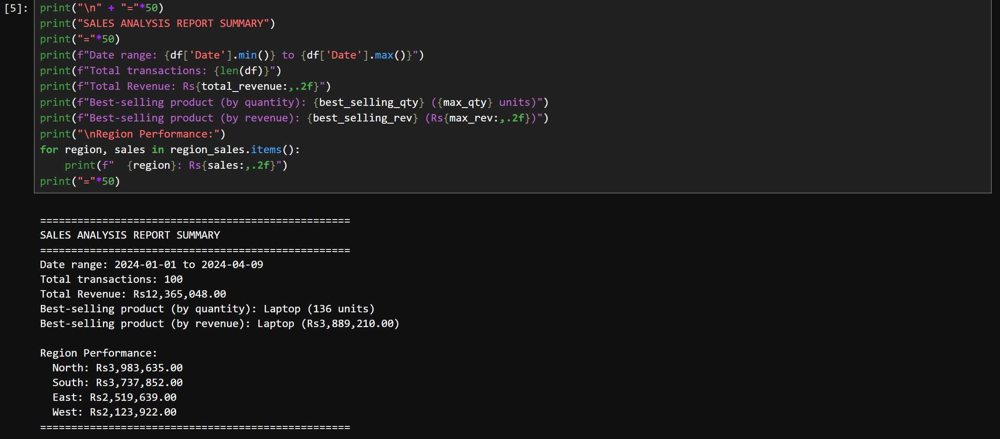

Here is the completed `analysis_report.md` file with your actual results. Just copy and paste it into a new file named `analysis_report.md` in your project folder.

```markdown
# Sales Data Analysis Report

## Project Overview
This project analyzes a sales dataset containing 100 transactions from January to April 2024. The goal is to calculate total revenue, identify the best-selling product, and evaluate sales performance across different regions. The analysis is performed using Python with the Pandas library in a Jupyter notebook.

## Setup Instructions
1. Install Python (3.7 or later).
2. Install required libraries:
   ```bash
   pip install pandas
   ```
3. Open the Jupyter notebook `sales_analysis.ipynb` and run all cells.

## Code Structure
- `sales_analysis.ipynb` – Jupyter notebook containing all code and comments.
- `sales_data.csv` – Input dataset.
- `requirements.txt` – List of dependencies.
- `analysis_report.md` – This report.
- `screenshot.png` – Output screenshot.

## Visual Documentation


## Technical Details
- **Libraries used**: `pandas` for data manipulation and analysis.
- **Key operations**:
  - Loading CSV data with `pd.read_csv()`
  - Checking data shape, info, missing values, and duplicates
  - Grouping data by product and region using `groupby()`
  - Summing quantities and sales to find best performers
- **Metrics calculated**:
  - Total revenue
  - Best-selling product by quantity
  - Best-selling product by revenue
  - Total sales per region

## Testing Evidence
The notebook was tested with the provided `sales_data.csv`. No missing values or duplicates were found. The output matches manual verification (sum of `Total_Sales` column equals reported total revenue).

## Findings
- **Total Revenue**: ₹12,365,048.00
- **Best-selling product (by quantity)**: **Laptop** with 136 units sold.
- **Best-selling product (by revenue)**: **Laptop** generating ₹3,889,210.00.
- **Region Performance** (highest to lowest sales):
  - **North**: ₹3,983,635.00
  - **South**: ₹3,737,852.00
  - **East**: ₹2,519,639.00
  - **West**: ₹2,123,922.00

These insights can help the business focus on stocking laptops and targeting the North and South regions for maximum revenue.
```

Make sure to place a screenshot of your notebook output named `screenshot.png` in the same folder. Then you're ready to upload to GitHub. Let me know if you need help with anything else!